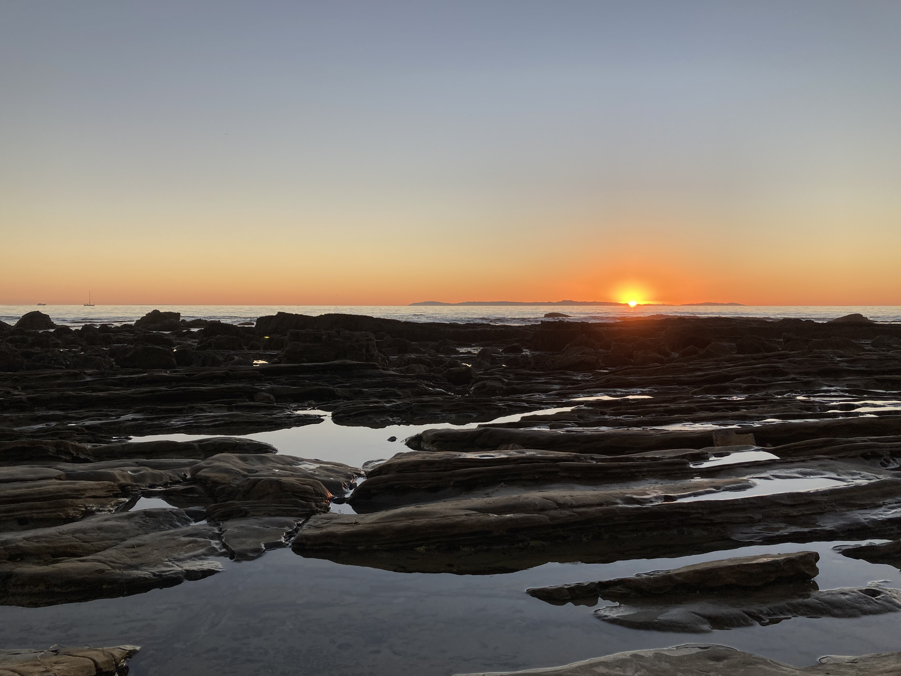

# Local Attractions

## Disneyland and Disney California Adventure Parks

Disneyland is the very first theme park opened by the Walt Disney Company, where Disney California Adventure was opened back in 2001. Disneyland offers more family friendly attractions, where California Adventure offers more thrilling ones. They are both located one block away from the hotel. 

  

    
  

**Please note:** Although tickets are sold at the gate, reservation is needed to get into the park. If you plan to visit them, we recommend booking online.

## Anaheim GardenWalk

  

    
STC Anaheim GardenWalk is a lifestyle center, offering many restaurants (e.g., California Pizza Kitchen, The Cheesecake Factory, etc.) and entertainment places (e.g., AMC Cinema, Escape Rooms, etc.). It is located one block away from the hotel.

  

  

    
  

## The Outlets at Orange

  

    
An open-air outlet mall in the city of Orange. It is a great stop for all kinds of shopping needs. It is about 3 miles or 5 km away from the hotel. It will take about 10 minutes by car ($10 to $15 for ride-hailing), or about 30 minutes by public transportation ($2 for bus route 47).

  

  

    
  

## Other Attractions

  

    

      
      
Sunset Beach

    

  

  

    

      
      
Beautiful Seaside

    

  

  

    

      
      
Coastal Tidal Flats

    

  

  

    

      
      
 Crystal Cove State Park

    

  

There are also many other great places to visit in Orange County. For example, Orange County is blessed with some of the most amazing beaches in California. The most famous ones in Orange County are Newport Beach, Laguna Beach, Long Beach, and Huntington Beach. These beaches offer a wide range of activities like sunbathing, paddleboarding, and surfing. 

If biking or hiking is your preference, there are also many hiking and biking trails in the area, such as the Crystal Cove State Park, which has miles of coastline to explore.
